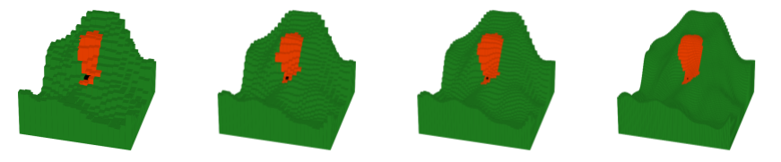

# Fire Suppression Instance Generator

This document provides detailed instructions on how to use the instance generator, as implemented by the script `instance_generator.py`.

The script supports a dynamic visualization of the generated instances. A slider allows the user to control the fire propagation over the landscape by going forward or backwards in time. As in Figure 3 in the paper, 3D bars are used to represent cells; red bars represent burned vegetation, and unburned areas are shown in green. The figure below presents a snapshot of this visualization. The same landscape is represented using different resolutions (grid sizes). 




## Requirements

- Python 3.6+
- Required packages:
  - `matplotlib`
  - `numpy`
  - `noise` (for Perlin noise generation)
  - `argparse`

## Quick Start

For those who are eager to generate an instance and see what it looks like, please type the following:

```bash
python instance_generation.py --grid Medium --slope Moderate --wind Light --seed 1 --show_animation
```

This will generate the instance files and display an interactive 3D visualization with a time slider to control fire propagation.

## Command-Line Arguments

### Terrain and Environment

| Argument | Type | Default | Options | Description |
|----------|------|---------|---------|-------------|
| `--grid` | str | Medium | Small, Medium, Large, Huge | Grid size (20x20, 30x30, 40x40, 80x80) |
| `--slope` | str | Moderate | Flat, Moderate, Steep | Terrain slope category |
| `--wind` | str | Light | Light, Moderate, Strong | Wind speed category  |
| `--Nxy` | float | 26240 | Any positive value | XY scaling parameter (feet) |
| `--WAF` | float | 0.3 | 0.0 - 1.0 | Wind Adjustment Factor for scaling wind speeds |

### Resources

| Argument | Type | Default | Options | Description |
|----------|------|---------|---------|-------------|
| `--num_resources` | str | Moderate | Few, Moderate, Many | Number of suppression resources |
| `--decision_points` | str | Moderate | Few, Moderate, Many | Number of decision points |
| `--resources_delay` | str | High | Low, Medium, High | Delay category |
| `--first_res_time` | str | Early | Early, Late, VeryLate | First release time |
| `--last_res_time` | str | VeryLate | VeryEarly, Early, Late, VeryLate | Last release time  |

### Output

| Argument | Type | Default | Description |
|----------|------|---------|-------------|
| `--seed` | int | 123 | Random seed  |
| `--save_plots` | flag | False | Save visualization plots (R0, height, wind) as PNG files. If not set, plots are discarded |
| `--show_animation` | flag | False | Display interactive 3D visualization with time slider |


## Output Files

The tool generates several output files, which are listed below
- JSON Instance File
- Log File
- Visualization Files
  - Heatmap of the base rate of spread $R_0$
  - Heatmap of the elevation of the terrain
  - Vector field depicting wind direction vectors
  - Visualization depicting how wind speed varies through the terrain

### JSON Instance File

**Format**: `{grid}_{slope}_{wind}_{resources_delay}_{num_resources}_{decision_points}_{first_res_time}_{last_res_time}_{seed}.json`

**Example**: `Large_Moderate_Light_High_Moderate_Moderate_Early_VeryLate_999.json`

The JSON file contains the following fields:
- `H`: Time horizon (minutes)
- `|V|`: Number of vertices
- `|R|`: Number of resource decision points
- `I`: Ignition vertex IDs (list of integers)
- `t`: Resource release times (list, where `t[i]` is the release time for resource i)
- `c`: Number of resources at each decision point (list, where `c[i]` is the number of resources released at time `t[i]`)
- `delta`: Resource delay values (list, where `delta[i]` is the delay for resource i)
- `arcs`: List of `[source_id, target_id, propagation_time]` triples for each arc
- `distance.coordinates`: List of `[x, y, z]` coordinates, where index i corresponds to vertex ID i

We use the following data structures and indexing conventions:

1. **Vertex IDs**: Vertices are indexed from `0` to `|V|-1` 

2. **Arcs**: Each arc is defined as `[u, v, time]` where:
   - `u` is the source vertex ID (0 to |V|-1)
   - `v` is the target vertex ID (0 to |V|-1)
   - `time` is the fire propagation time from u to v

3. **Coordinates**: The `distance.coordinates` list maps vertex IDs to spatial positions:
   - `coordinates[0]`: coordinates of vertex 0
   - `coordinates[1]`: coordinates of vertex 1
   - `coordinates[i]`: coordinates of vertex i

4. **Resources**: Resource properties are stored as parallel lists indexed by resource number:
   - `t[i]`: release time of resource i
   - `c[i]`: number of resources released at time `t[i]`
   - `delta[i]`: delay value of resource i
   - Resource indices start at 0

**Example**:
```json
{
  "H": 1440.0,
  "|V|": 900,
  "|R|": 10,
  "I": [450],
  "t": [72.5, 145.0, 217.5, ...],
  "c": [3, 3, 3, ...],
  "delta": [480.0, 480.0, 480.0, ...],
  "arcs": [
    [0, 1, 12.5],
    [0, 30, 15.2],
    ...
  ],
  "distance": {
    "coordinates": [
      [0, 0, 125.3],
      [874.67, 0, 130.1],
      ...
    ]
  }
}
```

### Log File

**Format**: `{instance_name}.log`

Contains detailed statistics and progress information:
- R0 field statistics (mean, max, min)
- Height field statistics
- Wind speed and angle statistics
- Slope angle statistics
- Horizon threshold calculations

### Visualization Files (only generated if `--save_plots` is used)

These plots are generated during instance creation and only saved when `--save_plots` is specified. Without this flag, the visualizations are computed but discarded.

1. **R0 Heatmap**: `R0_heatmap_seed{seed}_perlin{perlin_seed}_{grid}.png`
   - Shows the base rate of spread across the terrain

2. **Height Heatmap**: `Height_heatmap_seed{seed}_perlin{perlin_seed}_{grid}_{slope}.png`
   - Displays elevation data

3. **Wind Vectors**: `Wind_vectors_seed{seed}_angle{angle_seed}_{grid}_{wind}.png`
   - Visualizes wind direction vectors

4. **Wind Speed Segments**: `Wind_speed_segments_seed{seed}_speed{speed_seed}_{grid}_{wind}.png`
   - Shows wind speed variation across arcs

## Interactive Visualization

When the `--show_animation` flag is used, an interactive 3D visualization window opens with:
- **Time slider**: Control fire propagation by moving the slider forward or backward in time
- **3D rotation**: Click and drag to rotate the view
- **Color coding**:
  - Green bars: Unburned vegetation
  - Red bars: Burned areas
  - Black bar: Ignition point
  - Blue arrow: Wind direction

